Sample documentation. 


Automatically generate Mermaid markdown code-flows using CodeBERT. 

---
```python
def max(a, b): 
   if a > b: 
      return a 
   else: 
      return b
```
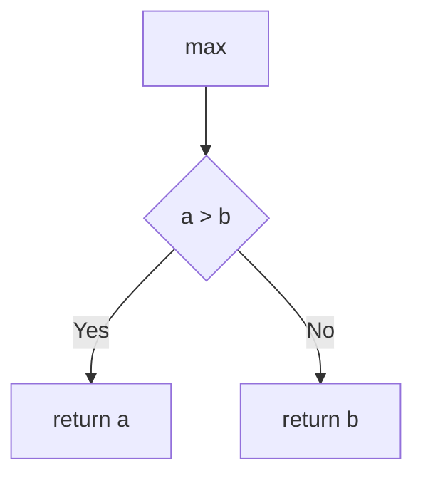
---
```python
def factorial(n):
   if n == 0: 
      return 1
   else:
      return n * factorial(n-1)
```
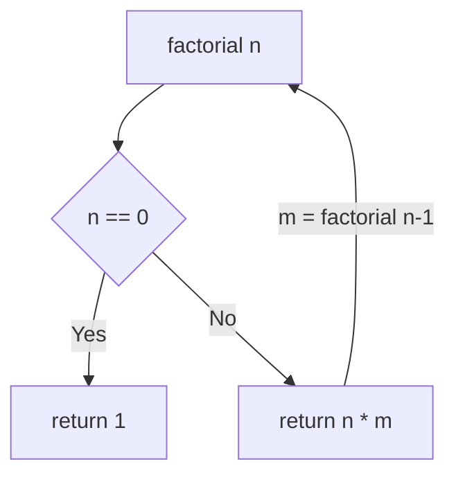
---
```python
def fibonacci(n): 
   if n <= 1: 
      return n 
   else: 
      return fibonacci(n-1) + fibonacci(n-2)
```
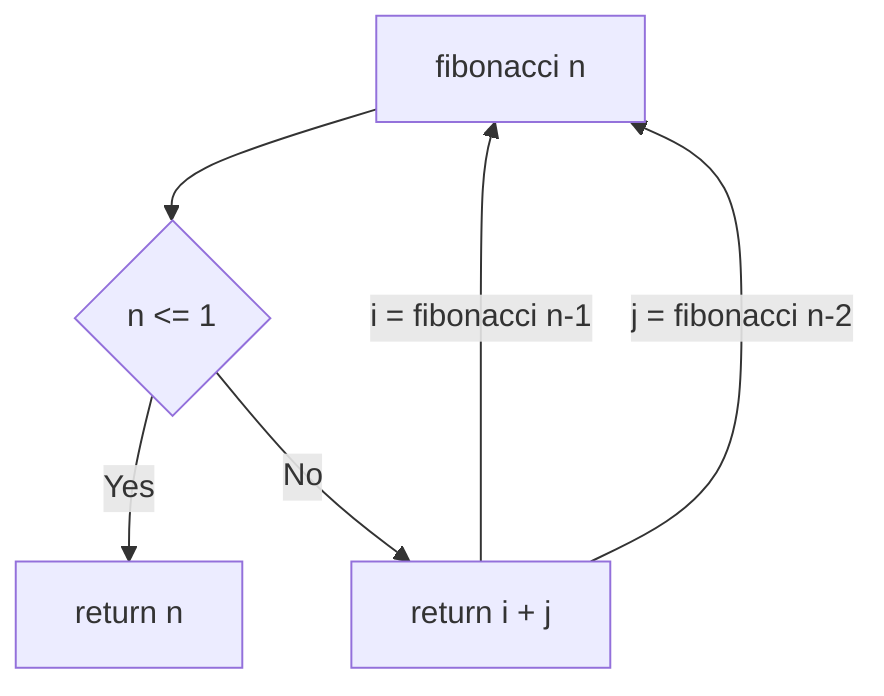
---
```python
def is_palindrome(s): 
   return s == s[::-1]
```
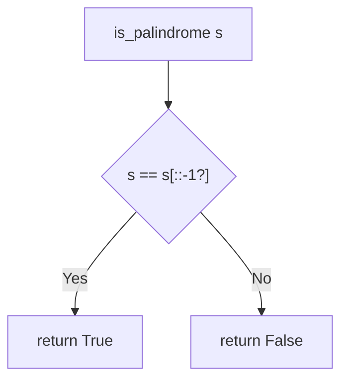
---
```python
def bubble_sort(arr): 
   for i in range(len(arr)): 
      for j in range(0, len(arr)-i-1): 
         if arr[j] > arr[j+1]: 
            arr[j], arr[j+1] = arr[j+1], arr[j]
```
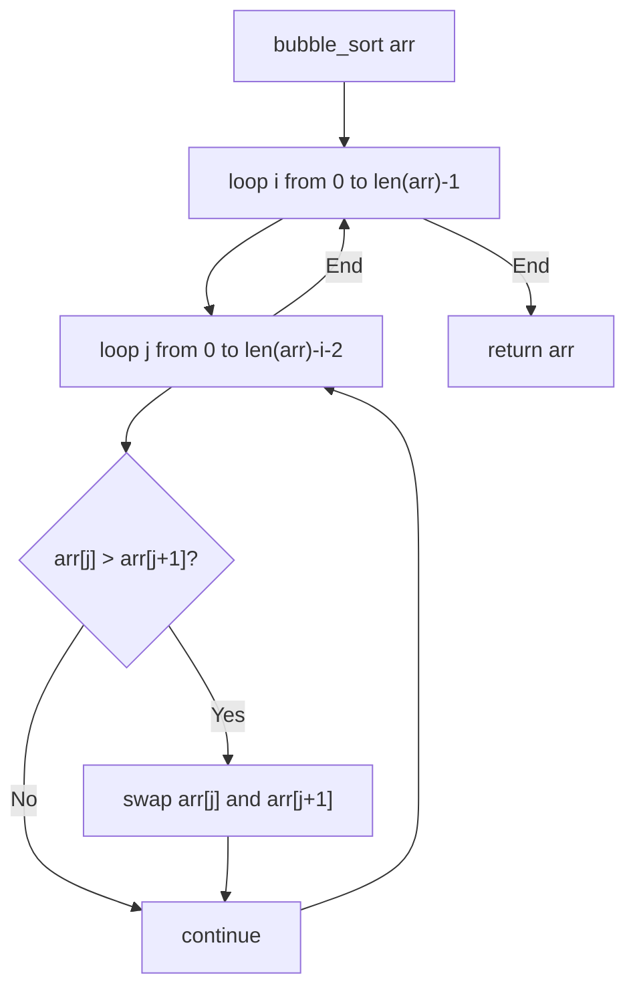
---
```python
def is_prime(n): 
   if n <= 1: 
      return False
   for i in range(2, int(n**0.5)+1): 
      if n % i == 0: 
         return False 
   return True
```
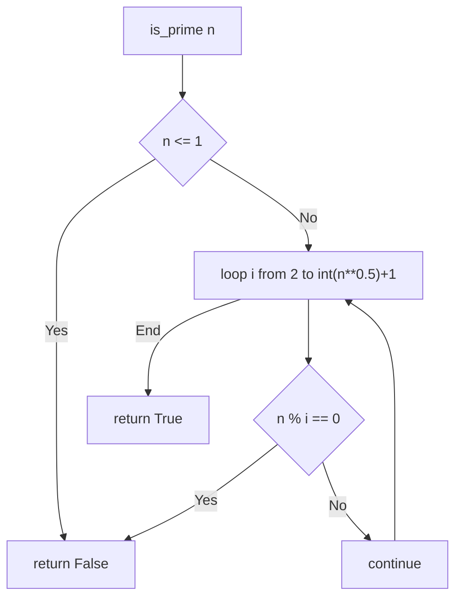
---
```python
def reverse_list(lst): 
   return lst[::-1]
```
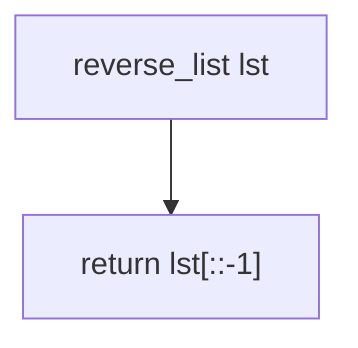
---
```python
def gcd(a, b): 
   while b: 
      a, b = b, a % b 
   return a
```
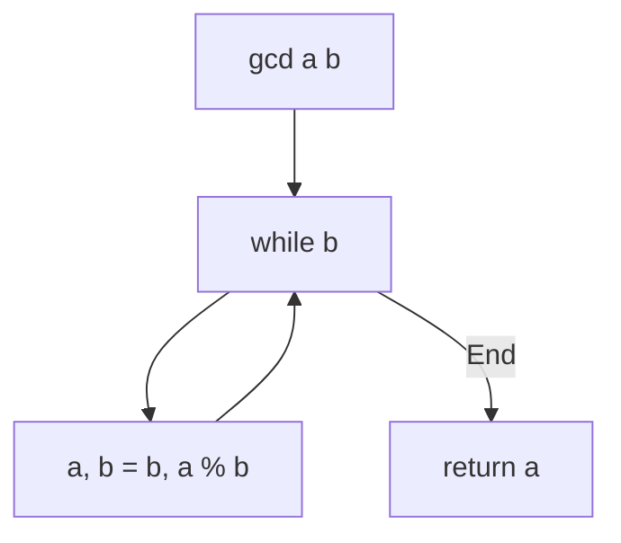
---
```python
def binary_search(arr, x): 
   l, r = 0, len(arr)-1 
   while l <= r: 
      mid = (l + r) // 2 
      if arr[mid] == x: 
         return mid 
      elif arr[mid] < x: 
         l = mid + 1 
      else: r = mid - 1
   return -1
```
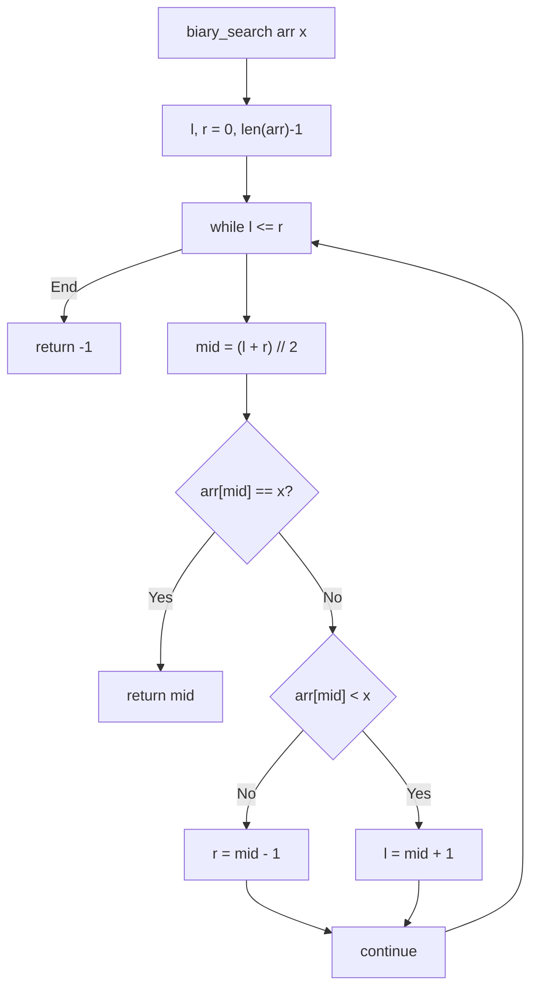
---
```python
def sum_list(lst): 
    return sum(lst)
```
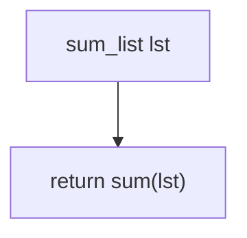
---
```python
def celsius_to_fahrenheit(c): 
    return (c * 9/5) + 32
```
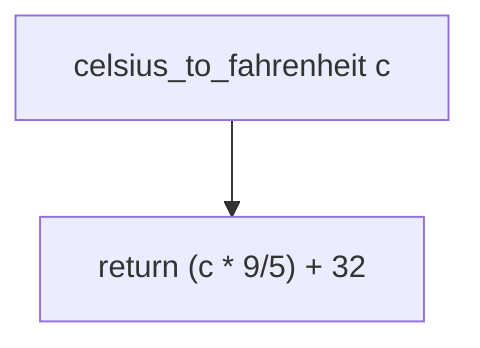